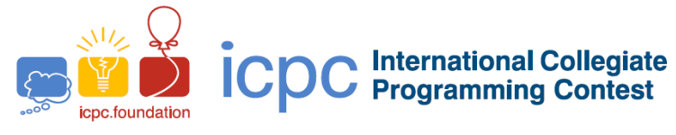

<section style="display: flex; flex-direction: column; align-items: center;">
  
  
  
</section>

# 📌 Description

Problems solved by the team [UFES] PythaOn in the XXV SBC programming marathon (phase 1), or South America/Brazil first phase by ICPC (International Collegiate Programming Contest).

## :book: Used languages 

 

## :pencil2: Team [UFES] PythaOn

<table>
  <tr>
    <td align="center">
      <a href="https://github.com/GabrielMotaBLima">
        
         
        
          <b>Gabriel Mota Bromonschenkel Lima</b>
        
      </a>
       
      

            Developer and solutions creator
      

      
    </td>
    <td align="center">
      <a href="https://github.com/guilhermegoncalvess">
         
        
          <b>Guilherme Gonçalves</b>
        
      </a>
       
      

            Developer and team manager
        

      
    </td>
    <td align="center">
      <a href="https://github.com/">
        
         
        
          <b>Luciano</b>
        
      </a>
       
      

            Developer and solutions creator
         

      
    </td>
 
